# BioBox Usage Example

The following example aims to give you a simple idea on how to get started with
BioBox for a simple task.

Here we are going to replicate a [**Minimap2**](https://github.com/lh3/minimap2)
example using its [test](https://github.com/lh3/minimap2/tree/master/test)
data.

## 1 - Fetch data:

For this example, we are creating a directory named **biobox_test** and filling
it with toy dataset:

```{bash}
mkdir /home/user/biobox_test
cd /home/user/biobox_test
wget https://biobox-info.github.io/test_data/MT-human.fa
wget https://biobox-info.github.io/test_data/MT-orang.fa
```
*please change directories names and locations according to your needs*

## 2 - Load up BioBox;

Please go to [Biobox - Github - Releases](https://github.com/hkmoon/biobox/releases)
and get BioBox!

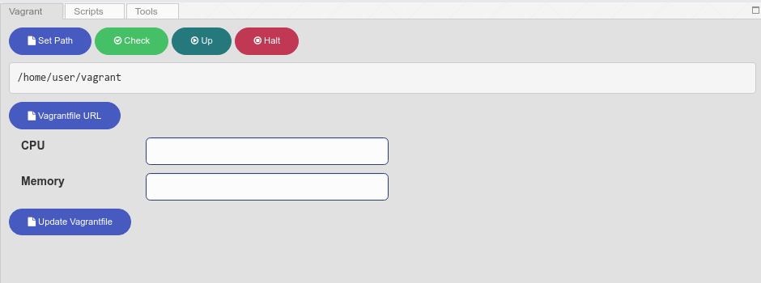

Then:
* do  "**Vagrant URL**";
* setup **CPU** number and amount of **memory** (in MB);
* do "**Update Vagrantfile**"

After these steps you should be able to load up Vagrant. For that, you can hit
the dark green button "**Up**" and later "**Check**" to check out the current
Vagrant status.

## 3 - Get tools:

In "**Tools**" tab, get **Minimap2** and **Samtools** Singularity images;

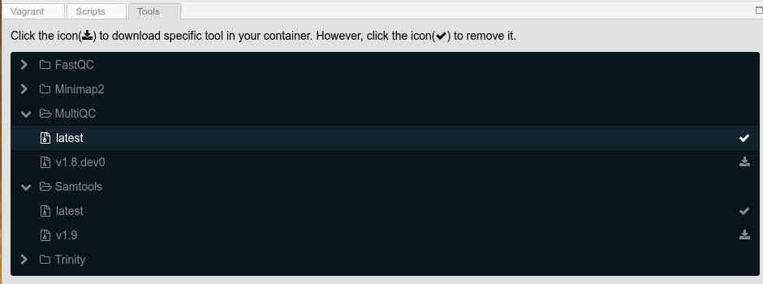

## 4 - Write the source files:
In "**Scripts**" tab, create the scripts using the "**New**" button following
what is described below:

4.1 - 01_minimap2_index.sh
```{bash}
#!/bin/bash

# build minimap2 index

singularity exec -B /vagrant/DATA:/scratch Minimap2_latest.sif \
minimap2 -x map-ont -d /scratch/${1%.fa}-ont.mmi /scratch/$1
```

4.2 - 02_minimap2_align.sh
```{bash}
#!/bin/bash

# align MT-orang to MT-human

singularity exec -B /vagrant/DATA:/scratch Minimap2_latest.sif \
minimap2 -a /scratch/MT-human-ont.mmi /scratch/$1 -o /scratch/${1%.fa}.sam
```

4.3 - 03_samtools.sh
```{bash}
#!/bin/bash

# sam to bam

singularity exec -B /vagrant/DATA:/scratch Samtools_latest.sif \
samtools view -bhS /scratch/${1%.fa}.sam -o /scratch/${1%.fa}.bam

# index bam file

singularity exec -B /vagrant/DATA:/scratch Samtools_latest.sif \
samtools index /scratch/${1%.fa}.bam
```

In the end, you should be able to check out the just created scripts:

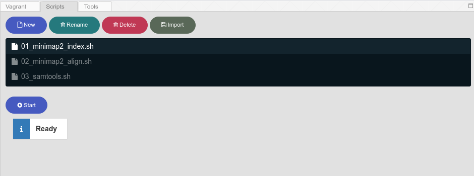


## 5 - Set up Data directory;

In "**Data**" tab, make sure to set up **biobox_test** directory using
"**Set Data Path**";


The downloaded data - MT-human.fa and MT-orang.fa - should be visible in the
"**Data**" tab;

## 6 - Run tasks using scripts;

### 6.1 Generate index:

#### 6.1.1 - Select Data

Go to "**Data**" tab and select **MT-human.fa** using the checkbox:

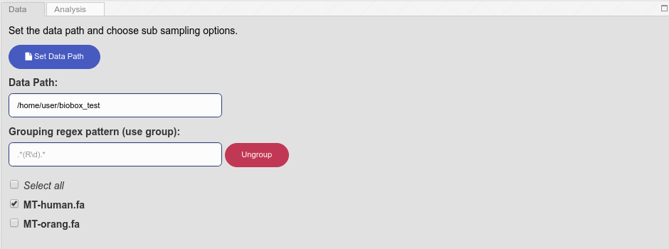

#### 6.1.2 - Select Script
At "**Scripts**" tab, select **01_minimap2_index.sh** script using a single mouse
click on it;

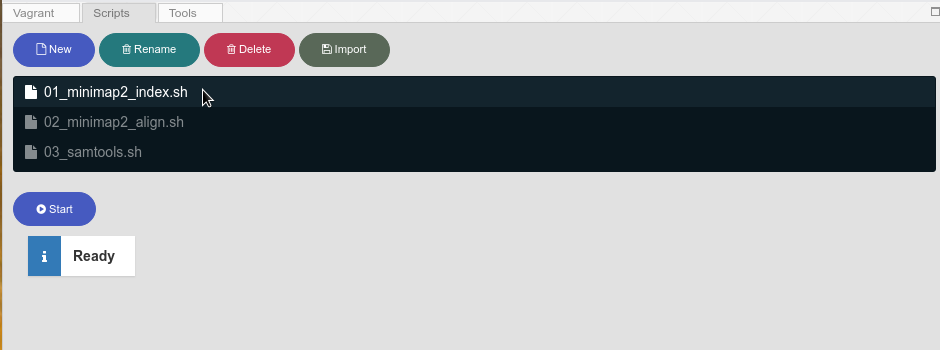

#### 6.1.3 - Start the process
Then push "**Start**" and check out the terminal screen to follow the progress;

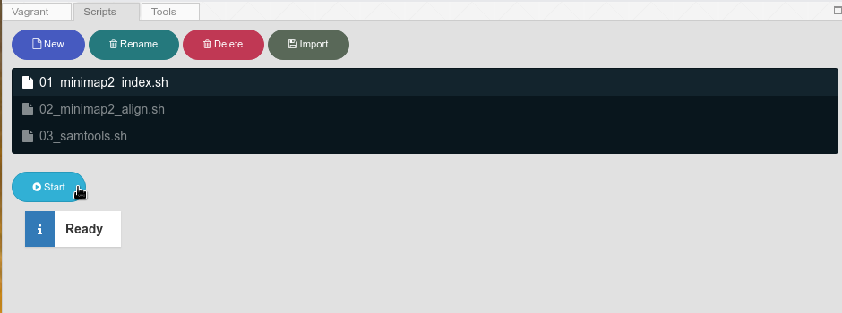


### 6.2 Align the data:

#### 6.2.1 - Select Data

Go to "**Data**" tab and select **MT-orang.fa** using the checkbox:

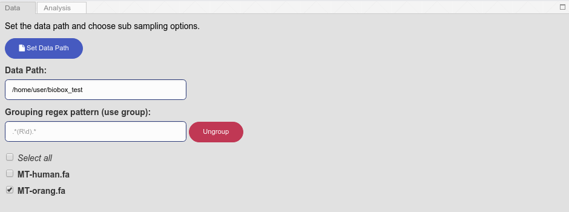

#### 6.2.2 - Select Script
At "**Scripts**" tab, select **02_minimap2_align.sh** script using a single mouse
click on it;

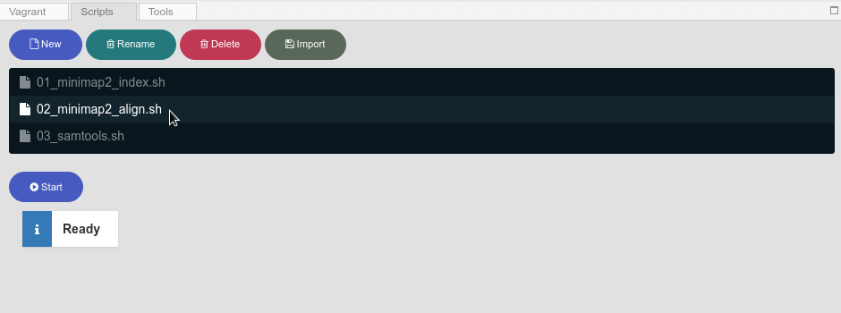

#### 6.2.3 - Start the process
Then push "**Start**" and check out the terminal screen to follow the progress;

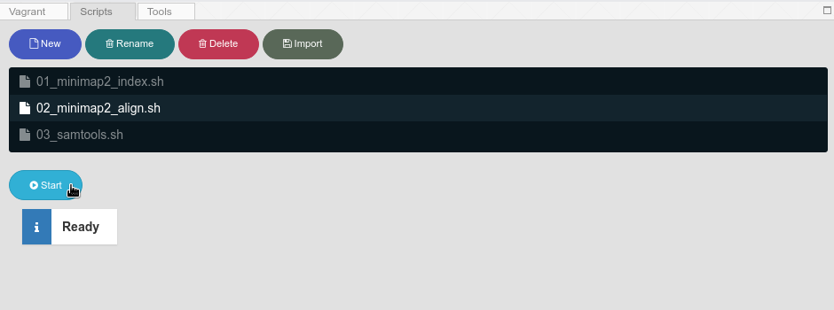

### 6.3 Convert SAM into BAM and create BAM index:

#### 6.3.1 - Select Data

Go to "**Data**" tab and select **MT-orang.fa** using the checkbox:


#### 6.2.2 - Select Script
At "**Scripts**" tab, select **03_samtools.sh** script using a single mouse
click on it;

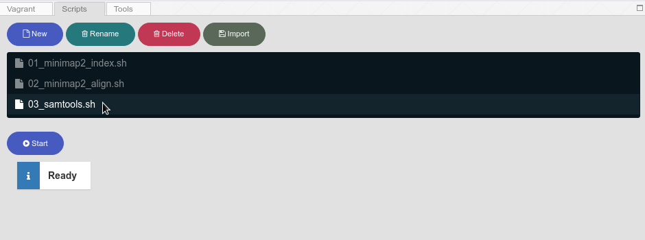

#### 6.2.3 - Start the process
Then push "**Start**" and check out the terminal screen to follow the progress;

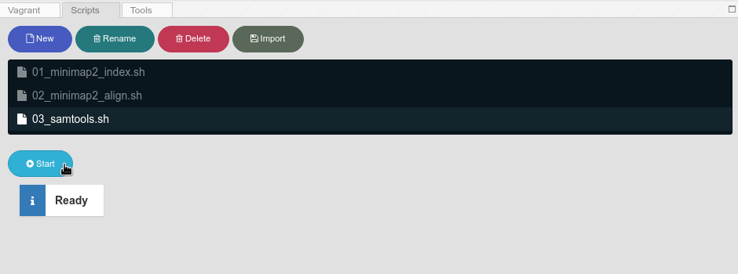


If you get errors, please double check the scripts (specially the singularity
commands). Also, you can check the issues at
[Biobox Github](https://github.com/hkmoon/biobox/issues) repository.

## 7 - Explore your data using [BeakerX](http://beakerx.com/)

Get **MT-human.fa** to DATA directory in order to use it as reference for IGV.

```{bash}
cp /home/user/biobox_test/MT-human.fa /home/user/vagrant/DATA/
```

### 7.1 - Start BeakerX
At "**Analysis**" tab you can start the BeakerX environment:

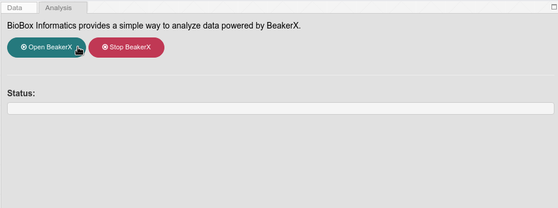

with that, a new web browser window will be loaded.

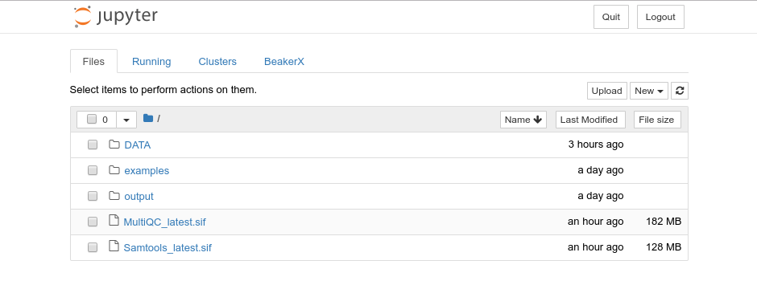

### 7.2 - Create a new Notebook - Python3

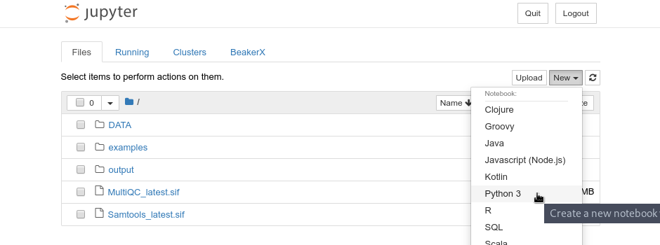

#### 7.2.1 Import igv

```{python}
import igv
```
#### 7.2.2 Define a custom reference
```{python}
b = igv.Browser(
    {"reference": {
        "id": "mt",
        "fastaURL": "DATA/MT-human.fa",
        "indexed": False,
    }}
)
```
#### 7.2.3 Get the browser

```{python}
b.show()
```

#### 7.2.4 Add bam track and inspect results
```{python}
b.load_track(
    {
        "name": "MT-Orang",
        "url": "DATA/MT-orang.bam",
        "indexURL": "DATA/MT-orang.bam.bai",
        "format": "bam",
        "type": "alignment",
        "height": 100
    })
```

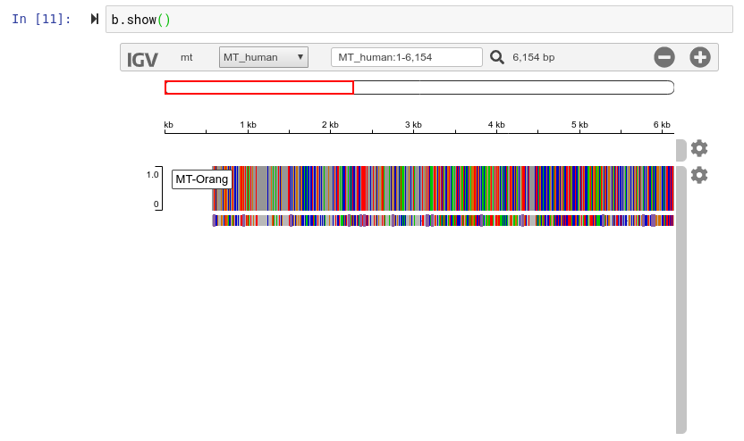

